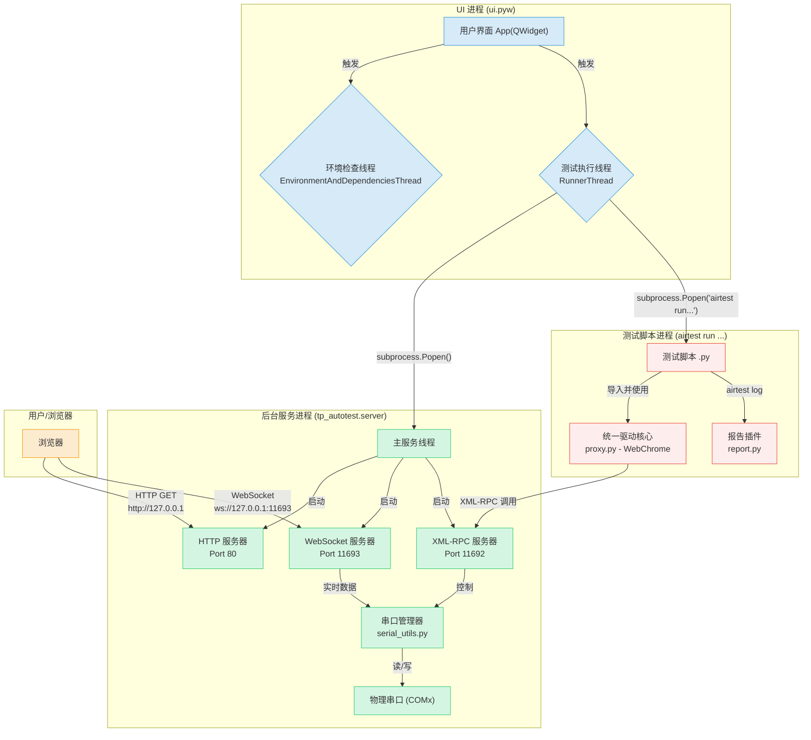
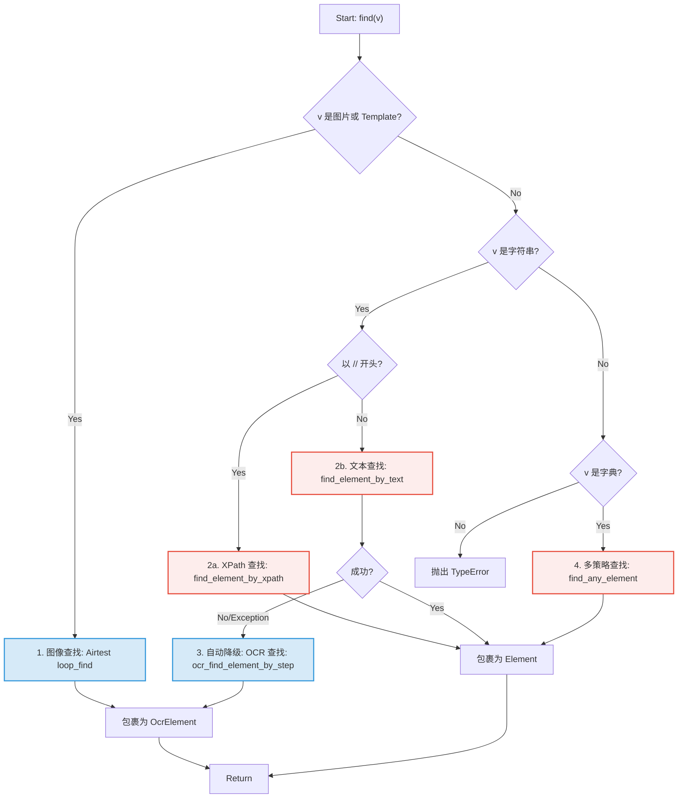

# Automa Agent框架技术文档

## 1. 系统概述 (System Overview)

`AutoTest` 是一个基于 Python 的自动化测试框架，它通过一个使用 PySide6 构建的图形用户界面（GUI），为测试人员提供了一个集测试环境自动配置、用例管理、一键执行与聚合报告生成于一体的综合性解决方案。

该框架以 `Airtest` 作为核心视觉自动化驱动，并通过自定义模块极大地扩展了其能力，特别是增加了对 **Web 自动化（基于 Selenium）** 和 **串口设备实时通信** 的深度支持。其设计目标是简化软硬件结合的测试流程，提高测试效率，并为特定类型的测试（如路由器、IoT设备等）提供开箱即用的自动化能力。

**核心特性:**

*   **环境零配置**: 首次运行时，能自动检测并安装所需的 Python 环境及依赖库。
*   **统一的 GUI 入口**: 所有操作，从参数配置到脚本执行，都可在图形界面中完成。
*   **强大的复合驱动**: 提供了增强版的 Selenium Web-Driver，无缝集成了图像识别、OCR 和串口 RPC 控制。
*   **实时串口监控**: 内置基于 Web 的串口监视器，可实时查看和发送串口数据。
*   **高度定制化报告**: 通过插件机制深度定制 Airtest 报告，使其包含丰富的自定义日志和断言截图。

---

## 2. 整体架构与核心流程 (Overall Architecture & Core Workflow)

### 2.1. 架构图 (Architecture Diagram)

系统由三个核心进程/线程组构成：**UI 进程**、**后台服务进程** 和 **测试脚本进程**。它们各司其职，通过标准化的协议进行解耦和通信。



### 2.2. 核心工作流程 (Core Workflow)

一个典型的测试流程如下：

1.  **启动与环境检查**: 用户双击运行 `ui.pyw`。程序启动后，`EnvironmentAndDependenciesThread` 线程会检查 `AutoTest` 环境、Python 解释器及所有 pip 依赖是否存在。如果缺失，它会自动尝试静默安装（必要时会请求管理员权限）。
2.  **配置与选择**: 用户在图形界面上配置机型信息、串口、网卡等参数，并在脚本列表中勾选需要执行的测试用例。
3.  **开始执行**: 用户点击“开始执行”按钮。
4.  **启动后台服务**: `RunnerThread` 线程首先通过 `subprocess.Popen` 在后台启动 `tp_autotest.server` 进程，该进程会立即监听 HTTP、WebSocket 和 XML-RPC 三个端口。
5.  **执行测试脚本**: `RunnerThread` 遍历用户勾选的用例列表，对每一个用例，它会构造一条 `airtest run ...` 命令，并通过 `subprocess.Popen` 启动一个独立的 **测试脚本进程**。
6.  **脚本与服务交互**: 在测试脚本进程中，脚本代码会实例化 `proxy.py` 中的 `WebChrome` 驱动。当脚本调用如 `driver.serial_send()` 等硬件相关方法时，`WebChrome` 驱动会通过 **XML-RPC** 协议，向后台服务进程的 11692 端口发起远程过程调用。
7.  **日志记录**: 在脚本执行过程中，`proxy.py` 中的 `@logwrap` 装饰器会将所有关键操作（如点击、断言、串口收发）的详细信息记录到 Airtest 的标准日志流中。
8.  **生成报告**: 单个脚本执行完毕后，`RunnerThread` 会立即调用 `airtest report ...` 命令，并加载 `report.py` 插件。该插件会解析日志流，将结构化的日志数据渲染成包含自定义样式的 `log.html`。
9.  **生成汇总报告**: 所有用例执行完毕后，`RunnerThread` 会使用 Jinja2 模板（`source/template.html`）生成一个包含所有测试结果链接和摘要信息的顶层报告 `result.html`。
10. **完成与清理**: `RunnerThread` 线程结束，向 UI 线程发送完成信号。如果后台服务是自动启动的，则会被关闭。UI 界面恢复初始状态，并自动打开 `result.html` 报告页面。

---

## 3. 模块详解 (Detailed Module Descriptions)

### 3.1. UI 控制器 (`ui.pyw`)

`ui.pyw` 是整个框架的用户入口和任务调度中心。它是一个复杂的 PySide6 单文件应用，主要职责包括：

*   **界面管理**: 构建和管理所有用户可见的窗口、卡片、按钮和表格，并通过 `QStackedWidget` 实现主页和“其他参数”页面的切换。
*   **配置持久化**: 通过 `setting.json` 文件加载和保存用户的所有设置，包括机型信息、脚本勾选状态、Python 解释器路径等。
*   **环境管理器 (`EnvironmentAndDependenciesThread`)**: 这是保证“开箱即用”的关键。此线程负责：
    *   检查并解压 `source/autotest.env` 到 `C:\Program Files\AutoTest`。
    *   检查 `C:\Program Files\AutoTest\Python39` 是否存在，如果不存在，则静默运行 `source/python-3.9.11-amd64.exe` 进行安装。
    *   检查并安装 `requirements.txt` 中列出的所有 pip 依赖，包括对本地 `source/tp_autotest` 包的安装。
*   **测试执行器 (`RunnerThread`)**: 这是测试流程的“大脑”。此线程负责：
    *   按顺序启动和停止后台服务进程。
    *   为每个选中的用例构建并执行 `airtest` 命令。
    *   实时捕获 `airtest` 进程的 `stdout`，并显示在 UI 的日志行中。
    *   在每个用例结束后，调用 `airtest report` 生成单个报告。
    *   在所有用例结束后，生成最终的 `result.html` 汇总报告。
*   **服务手动控制**: UI 上的“服务”按钮允许用户独立于测试流程，手动启动或停止后台服务，并自动打开串口监控网页，方便进行设备调试。

### 3.2. 后台服务 (`server.py`)

`server.py` 是连接软件与物理硬件的桥梁。它启动后，会在一个进程中并发运行三个服务：

1.  **HTTP 服务器 (80端口)**: 基于 `http.server`，职责单一，仅用于向浏览器提供 `serial_monitor.html` 页面及其静态资源（JS/CSS）。
2.  **WebSocket 服务器 (11693端口)**: 基于 `websockets` 库，负责与 `serial_monitor.html` 页面进行实时、双向的通信，用于推送串口数据和接收用户输入。
3.  **XML-RPC 服务器 (11692端口)**: 基于 `xmlrpc.server`，向自动化脚本暴露了一套远程过程调用接口。`proxy.py` 中的客户端通过此接口来执行串口的打开、关闭、读写等操作。

这三个服务共享同一个 `SerialServer` 实例，确保了对物理串口的所有操作都是同步和互斥的。

### 3.3. 统一驱动核心 (`proxy.py`)

`proxy.py` 的核心是 `WebChrome` 类，它并非一个简单的代理，而是一个“**超级驱动 (Supercharged Driver)**”。它通过**继承** `selenium.webdriver.Chrome`，天生就具备了所有 Web 自动化能力。然后，在此基础上，它进一步集成了图像识别、OCR、硬件控制（通过RPC）和网络操作等多种能力，从而为测试脚本提供了一个功能全面、接口统一的驱动对象。测试脚本只需要与这一个 `driver` 对象交互，即可完成跨领域的复杂自动化任务。

*   **关键实现请参考后续章节**: `5. proxy.py 关键实现细节`

### 3.4. 定制化报告插件 (`report.py`)

`report.py` 的本质是一个 **Airtest 报告插件**。它在 `airtest report` 命令执行时被动态加载，通过“**猴子补丁 (Monkey Patching)**”技术，在运行时替换掉 Airtest 原始报告类中的核心方法，从而实现：

*   **日志解析**: 识别由 `proxy.py` 中 `@logwrap` 记录的自定义日志结构。
*   **内容翻译**: 将 `serial_send(...)` 等内部函数调用，翻译成“向串口COM3发送命令...”等人类可读的描述。
*   **富文本渲染**: 将多行的串口日志、JSON 数据、图像断言的对比图等富文本内容，直接、完整地渲染到报告的步骤详情中。
*   **模板替换**: 将 Airtest 的默认报告模板替换为自定义的 `log_template.html`，实现报告样式的完全定制。

### 3.5. 网络工具 (`network_utils.py`)

此模块提供了网络相关的原子能力，供 `proxy.py` 中的驱动核心调用。

*   **`WifiManager` 类**: 封装了对 `pywifi` 库的操作，实现了平台无关的 Wi-Fi 连接与断开功能。
    *   **实现原理**: 在初始化时，它会获取指定名称的无线网卡接口。调用 `connect_wifi` 时，它会创建一个新的 Wi-Fi 配置文件（Profile），设置 SSID、密码和加密方式（WPA2PSK/CCMP），然后通过网卡接口添加并连接此配置文件。连接后会循环检查接口状态，直到连接成功或超时。
*   **`ping(ip_address, ...)` 函数**: 封装了对系统 `ping` 命令的调用。
    *   **实现原理**: 它会判断当前操作系统。在 Windows 上，它执行 `ping -n <count> <ip_address>` 命令，并使用正则表达式（`re.search`）从中英文（`Lost`/`丢失`）的输出中解析丢包率。在其他系统上，则执行 `ping -c <count> <ip_address>`。它通过 `subprocess.run` 执行命令，捕获输出，并根据命令的返回码和解析到的丢包率来判断 Ping 是否成功。

---

## 4. 核心交互协议 (Core Interaction Protocols)

### 4.1. 自动化脚本 (XML-RPC) 通信协议

这是为自动化测试脚本设计的“机器对机器”协议。

*   **协议类型**: **XML-RPC**
*   **端点 (Endpoint)**: `http://127.0.0.1:11692/RPC2`
*   **交互方式**:
    1.  `proxy.py` 中的 `SerialClient` 类（别名为 `SerialManager`）在初始化时，创建一个 `ServerProxy` 对象，连接到上述端点。
    2.  `SerialClient` 类巧妙地利用了 Python 的 `__getattr__` 魔法方法。当测试脚本调用一个 `SerialClient` 实例上不存在的方法时（如 `serial_open`），`__getattr__` 会自动将这个方法名和参数打包，通过 XML-RPC 发送给远程服务器。
    3.  后端的 `XML-RPC 服务器` 接收到请求后，调用其注册的 `SerialServer` 实例的同名方法，并将执行结果通过 XML-RPC 返回。
*   **交互图示**:
    ```text
    测试脚本 (driver)         proxy.py (SerialClient)         server.py (XML-RPC Server)
        |                             |                                  |
        |--- .serial_open() --------->|                                  |
        |                             |--- XML-RPC Call('open_port') --->|
        |                             |                                  |---> 执行 open_port 逻辑
        |                             |                                  |<--- 返回 True/False
        |                             |<------ XML-RPC Response ---------|
        |<---- return True/False -----|
    ```

### 4.2. 串口监控页面 (WebSocket) 通信协议

这是为人机交互设计的实时监控协议，实现了前端与后端之间的实时双向通信。

*   **协议类型**: **WebSocket**
*   **端点 (Endpoint)**: `ws://127.0.0.1:11693`
*   **数据格式**: **JSON**。所有消息都被封装成 JSON 对象，其通用结构为 `{"type": "消息类型", "payload": { "数据负载" }}`。

为了清晰起见，我们将消息分为“管理接口”和“数据接口”两类。

###### **管理接口 (Management Interface)**

这类消息用于处理串口的打开、关闭、订阅、状态查询和错误通知等管理任务。

| 方向 | 消息类型 (type) | `payload` 内容 | 描述 |
| :--- | :--- | :--- | :--- |
| 客户端 -> 服务器 | `list_ports` | `{}` | 请求获取当前所有已管理串口的列表。 |
| 客户端 -> 服务器 | `subscribe_port` | `{"port": "COM3", "baudrate": 115200}` | 请求订阅指定串口，如果未打开则尝试打开。 |
| 客户端 -> 服务器 | `unsubscribe_port` | `{"port": "COM3"}` | 请求取消订阅指定串口。 |
| | | | |
| 服务器 -> 客户端 | `port_list` | `{"ports": {"COM3": {"is_open": true, ...}}}` | 响应请求，返回所有已管理串口的详细信息。 |
| 服务器 -> 客户端 | `port_opened` | `{"port": "COM3", "baudrate": 115200}` | 通知客户端，某个串口已成功打开。 |
| 服务器 -> 客户端 | `port_closed` | `{"port": "COM3"}` | 通知客户端，某个串口已被关闭。 |
| 服务器 -> 客户端 | `port_subscribed` | `{"port": "COM3", "baudrate": 115200}` | 确认客户端已成功订阅指定串口。 |
| 服务器 -> 客户端 | `port_unsubscribed` | `{"port": "COM3"}` | 确认客户端已成功取消订阅指定串口。 |
| 服务器 -> 客户端 | `error` | `{"message": "错误描述信息"}` | 当发生错误时，向客户端发送错误通知。 |

###### **数据接口 (Data Interface)**

这类消息专门负责在前后端之间传输实时的串口数据。

| 方向 | 消息类型 (type) | `payload` 内容 | 描述 |
| :--- | :--- | :--- | :--- |
| 客户端 -> 服务器 | `data` | `{"port": "COM3", "data": "ls -l"}` | 将用户在终端输入的**原始字符串**发送到指定串口。 |
| 服务器 -> 客户端 | `data` | `{"port": "COM3", "data": "BASE64..."}` | 推送从串口读取到的数据，数据为 **Base64 编码**的字符串。 |

*   **连接管理与错误处理**:
    *   **重连机制**: 前端 JavaScript 在 WebSocket 连接断开时 (`ws.onclose` 事件触发) 会通过 `setTimeout(connect, 3000)` 机制，尝试每 3 秒自动重连，以提高连接的健壮性。
    *   **错误通知**: 服务器端会通过 `{"type": "error", "payload": {"message": "..."}}` 消息通知客户端发生的错误，前端会弹窗显示。

*   **交互图示**:
    ```text
    浏览器 (Xterm.js)                                        server.py (WebSocket Server)
         |                                                              |
    (页面加载)                                                          |
         | --- WebSocket Handshake -----------------------------------> | (建立长连接)
         |                                                              |
         | --- {"type":"list_ports"} ---------------------------------> |
         | <--- {"type":"port_list", "payload":{...}} ----------------- |
         |                                                              |
         | --- {"type":"subscribe_port", "payload":{"port":"COM3"}} --> |
         | <--- {"type":"port_subscribed", "payload":{"port":"COM3"}} - |
         |                                                              |
         | <--- {"type":"data", "payload":{"port":"COM3", "data":"BASE64_DATA"}} --- | (服务器主动推送串口输出)
         |                                                              |
    (用户输入 "ls")                                                     |
         | --- {"type":"data", "payload":{"port":"COM3", "data":"ls"}} --> | (客户端发送用户输入)
         |                                                              |
         | <--- {"type":"error", "payload":{"message":"..."}} --------- | (错误通知)
    ```

### 4.3. 网页服务 (HTTP) 协议

这是最简单的一环，仅用于“分发”网页应用本身。

*   **协议类型**: **HTTP/1.1**
*   **端点 (Endpoint)**: `http://127.0.0.1:80`
*   **交互方式**: 浏览器发起标准的 `GET` 请求，服务器返回对应的文件内容。它的职责仅限于此，不参与任何动态数据的交互。
*   **交互图示**:
    ```text
    浏览器                                server.py (HTTP Server)
       |                                          |
       |---------- GET / ------------------------->|
       |                                          |
       |<--------- serial_monitor.html -----------|
       |                                          |
       |---------- GET /static/xterm.js ---------->|
       |                                          |
       |<--------- xterm.js 文件内容 -------------|
    ```

---

## 5. `proxy.py` 关键实现细节

本章节将深入 `proxy.py` 的 `WebChrome` 类，解析其核心功能和关键类的具体实现方法。

### 5.1. 统一查找函数 `find()` (图文流程详解)

`find()` 方法是 `WebChrome` 类的核心亮点之一，它提供了一个统一的、多策略的元素查找入口。其设计思想是根据输入参数的类型，自动选择最优的查找策略，并在必要时自动降级，以最大化查找的成功率。

##### **执行流程图**



##### **流程文字说明**

1.  **图像查找**: 如果传入的是 Airtest 的 `Template` 对象或图片路径，则调用 Airtest 的 `loop_find()` 进行**图像匹配**。结果包装为 `OcrElement`。
2.  **文本/定位器查找 (核心逻辑)**:
    *   **a. XPath 优先**: 如果字符串以 `//` 开头，则直接使用 `find_element_by_xpath()`。
    *   **b. Selenium 文本查找**: 否则，首先尝试用 `find_element_by_text()` 在 DOM 中查找文本节点。
    *   **关键 - 自动降级到 OCR**: 如果 Selenium 查找失败，`find()` 会捕获异常，然后自动**降级**，调用 OCR 功能在屏幕截图上“读取”并定位文本。
3.  **多策略字典查找**: 如果传入的是字典，`find_any_element()` 会遍历字典中所有定位策略（`id`, `xpath` 等）并逐一尝试。
4.  **返回结果**: DOM 定位方式返回 `Element` 对象；视觉方式（图像/OCR）返回 `OcrElement` 对象。

### 5.2. `Element` 包装类

`Element` 类是对 Selenium 原生 `WebElement` 对象的封装。其主要目的是在不改变原有 Selenium API 使用习惯的前提下，为元素操作**自动注入日志记录**功能。

*   **`__init__(self, _obj, log)`**:
    *   在构造时，它接收两个参数：`_obj` 是原始的 Selenium `WebElement` 对象，`log` 是一个预先由 `_gen_screen_without_log` 生成的、包含截图路径和元素位置信息的字典。
*   **核心方法接口**:
    *   **`click()`**: 当调用 `element.click()` 时，它首先会执行父类 `WebElement` 的原始 `click()` 方法来完成点击操作，然后**返回**构造时存下的 `log` 字典。这个返回值会被外层的 `@logwrap` 装饰器捕获，从而在报告中生成一个带有截图和高亮位置的详细步骤。
    *   **`send_keys(*value)`**: 与 `click()` 类似，它首先调用父类的 `send_keys()` 方法完成输入，然后返回 `log` 字典用于报告生成。
    *   **`is_on()`**: 检查开关状态的增强方法。它会依次尝试查找内部的 `<input type="checkbox">` 并检查其 `checked` 状态和内部 `role="switch"` 的元素并检查其 `aria-checked` 属性。只要有一种判定为“开”，即返回 `True`，否则返回 `False`。

### 5.3. `OcrElement` 包装类

`OcrElement` 类是为**非 Selenium 方式**（如图像识别和 OCR）找到的“元素”设计的包装器。它没有父类，但提供了与 `Element` 类相似的接口，使得测试脚本可以无差别地对它们进行操作。

*   **`__init__(self, driver, element_data, log)`**:
    *   构造时接收 `driver` 实例、一个包含元素信息的字典 `element_data`（例如 `{'center': (x, y), 'text': '识别的文字'}`）和日志信息。
*   **核心方法接口**:
    *   **`click()`**: 这是与 `Element.click()` 的一个关键区别。它不使用 Selenium 的点击，而是根据 `element_data` 中存储的中心点坐标 `center`，直接调用驱动中的 `_move_to_pos()` 和 `_click_current_pos()` 方法，通过 `pynput` 库来**模拟系统级的鼠标移动和点击**。
    *   **`text()`**: 这个方法的实现非常巧妙。它并不仅仅返回构造时传入的旧文本，而是会根据 `center` 坐标，在**新的屏幕截图**上截取一小块感兴趣的区域（ROI），并对这个小区域**重新执行一次 OCR**。这是一种“**文本二次确认**”机制，可以获取到元素在当前时刻最新的文本内容，有效避免了因页面刷新导致文本变化而产生的问题。
    *   **`is_on()`**: 一个自定义方法，用于判断开关（toggle）类控件的状态。它通过在元素的区域内进行模板匹配，查找预定义的“开启”或“关闭”状态的小图片，来判断开关是否开启。

### 5.4. OCR 相对定位查找实现 (`find_element_by_ocr`)

此功能是 `proxy.py` 中一个非常强大和复杂的特性，它允许通过“视觉语言”来定位元素，例如“找到‘用户名’标签右边的输入框”。其背后是一套精密的算法，将无序的 OCR 结果整理成类似表格的结构，然后进行导航。

以下是该算法的详细实现步骤：

##### **第 1 步: 全屏 OCR & 预处理**

1.  **执行 OCR**: 首先，对当前整个浏览器视图进行截图，并调用 `PaddleOCR` 对截图进行完整的文字识别。
2.  **获取结果**: OCR 引擎返回一个包含多个结果的列表。每个结果都是一个元组，包含文字的**边界框（bounding box）**和**识别出的文本**。
    *   例如: `[ [ [[x1,y1], [x2,y2], [x3,y3], [x4,y4]], ('文字', 置信度) ], ... ]`
3.  **计算中心点**: 对每个识别出的文字块，根据其边界框坐标计算出中心点 `(cx, cy)`。此时，我们得到一个无序的、包含 `{text, center, box}` 等信息的对象列表。

##### **第 2 步: 行列整理 (Row & Column Organization)**

这是将无序文字块转化为结构化数据的关键步骤，目的是模拟人眼阅读时对齐的感知。

1.  **垂直排序**: 首先，将所有文字块对象根据其中心点的 `cy` 坐标进行**从上到下**的排序。
2.  **行分组 (Row Grouping)**:
    *   创建一个空的“行列表” `rows`。
    *   从已排序的第一个文字块开始，创建第一个“新行”，并将其放入 `rows`。
    *   遍历剩余的文字块：
        *   对于每个文字块，判断它的 `cy` 坐标是否与 `rows` 中最后一行的平均 `y` 坐标足够接近（在一个预设的垂直容差范围内，例如行高的 50%）。
        *   如果**是**，则认为该文字块属于同一行，将其追加到最后一行的列表中。
        *   如果**否**，则认为它开启了一个新的文本行，因此创建一个包含此文字块的“新行”，并将其追加到 `rows` 列表中。
3.  **行内排序**: 遍历 `rows` 中的每一行，对行内的所有文字块根据其中心点的 `cx` 坐标进行**从左到右**的排序。

经过这一步，我们就得到了一个类似二维数组的结构 `rows = [[row1_block1, row1_block2], [row2_block1, ...]]`，它在逻辑上还原了页面的行列布局。

##### **第 3 步: 锚点定位 (Anchor Localization)**

1.  遍历刚刚整理好的 `rows` 结构。
2.  查找文本内容与用户传入的 `anchor_text` 完全匹配的那个文字块。
3.  记录下这个“锚点”文字块在二维结构中的**行索引**和**列索引**（`anchor_row_idx`, `anchor_col_idx`），并将其坐标作为导航的**起始点**。

##### **第 4 步: 步进式查找 (Step-wise Search)**

根据用户传入的 `steps` 列表（例如 `['right', 'down']`），进行坐标导航。

1.  初始化当前位置：`current_row = anchor_row_idx`, `current_col = anchor_col_idx`。
2.  循环处理每一步：
    *   如果步骤是 **`'right'`**: `current_col` 加 1。新的目标就是同一行中的下一个元素。
    *   如果步骤是 **`'left'`**: `current_col` 减 1。
    *   如果步骤是 **`'down'`**: `current_row` 加 1。此时，为了模拟“正下方”的元素，算法会在新的 `current_row` 这一行中，查找一个与**上一步**所在元素**水平中心 `cx` 最接近**的文字块，并将其作为新的目标。
    *   如果步骤是 **`'up'`**: `current_row` 减 1，逻辑与 `down` 类似。
3.  在每一步移动后，都会进行边界检查，防止索引越界。

##### **第 5 步: 应用偏移与绘图**

1.  **确定目标**: 完成所有步进查找后，位于 `rows[current_row][current_col]` 的文字块就是最终找到的目标元素。
2.  **应用偏移 (`offset`)**: 获取目标元素的中心坐标 `(cx, cy)`，然后加上用户传入的 `offset` 元组 `(ox, oy)`，得到最终的精确操作点：`final_pos = (cx + ox, cy + oy)`。
3.  **绘图**: 为了方便调试和报告展示，代码会在截图上用不同颜色的矩形框出“锚点元素”和最终的“目标元素”，并用十字线或圆点标记出应用偏移后的 `final_pos`。这张带有标记的图片会被保存下来，用于生成报告。

##### **第 6 步: 封装并返回**

1.  将最终目标元素的信息（文本、边界框、中心点等）和计算出的 `final_pos` 封装到一个字典中。
2.  使用这个字典和带有标记的截图信息，共同创建一个 `OcrElement` 对象并返回。
3.  由于返回的是一个标准化的 `OcrElement` 对象，测试脚本可以继续对其进行 `.click()` 或 `.text()` 等链式操作。
